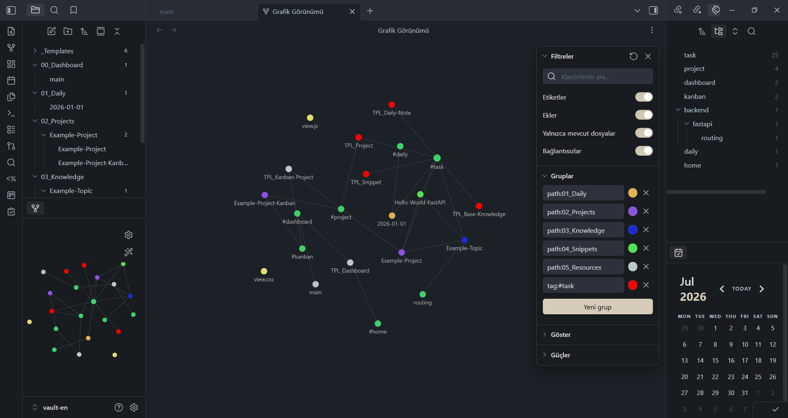
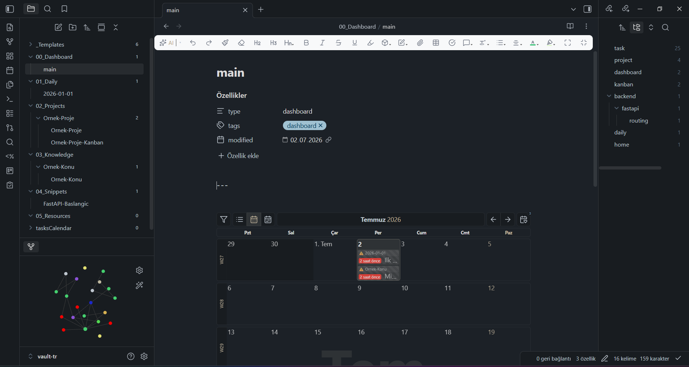
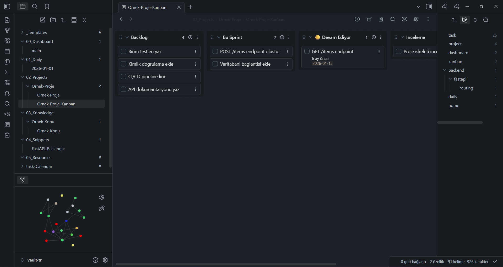

# Obsidian Developer Vault Template

A production-ready, opinionated Obsidian vault template built for developers. Structured for knowledge management, project tracking, daily journaling, and code snippet organization.

> Choose your language / Dilini sec:
> - [English Setup Guide](#english-setup-guide)
> - [Turkce Kurulum Rehberi](#turkce-kurulum-rehberi)

---

## English Setup Guide

### What's included

| Folder | Purpose |
|--------|---------|
| `00_Dashboard/` | Main dashboard with task calendar view |
| `01_Daily/` | Daily notes — auto-created from template |
| `02_Projects/` | Project notes + Kanban boards |
| `03_Knowledge/` | Structured knowledge base with topic trees |
| `04_Snippets/` | Code snippets with explanations |
| `05_Resources/` | References, PDFs, and assets |
| `_Templates/` | All note templates (Templater-based) |
| `tasksCalendar/` | Custom DataviewJS calendar view |

### Screenshots

#### Main Dashboard (Calendar View)


#### Project Kanban Board


#### Knowledge Graph View



### Credits

- The custom monthly task calendar in the dashboard (`tasksCalendar/`) is powered by [Obsidian-Tasks-Calendar](https://github.com/702573N/Obsidian-Tasks-Calendar) by 702573N. *Special thanks to 702573N for creating and sharing this amazing visualization tool!*

### Required Plugins

Install these from **Settings → Community Plugins → Browse**:

| Plugin | Purpose | Required |
|--------|---------|----------|
| Templater | Auto-templates on file creation | Yes |
| Tasks | Task tracking with due dates (`#task`) | Yes |
| Dataview | DataviewJS for dashboard calendar | Yes |
| QuickAdd | `Ctrl+X` quick task capture | Yes |
| Kanban | Kanban project boards | Yes |
| Calendar | Daily note calendar sidebar | Yes |
| Obsidian Git | Git backup | Recommended |
| Omnisearch | Full-text search across vault | Recommended |
| Code Styler | Styled code blocks | Optional |
| Colored Tags | Tag color highlighting | Optional |
| Tag Wrangler | Tag management and renaming | Optional |
| Icon Folder | Folder icons in file explorer | Optional |
| File Color | Color files in explorer | Optional |
| File Explorer Note Count | Note count badges | Optional |
| File Explorer Plus | Enhanced file explorer | Optional |
| Ninja Cursor | Smooth cursor animation | Optional |
| Commander (cmdr) | Customize toolbars | Optional |
| Editing Toolbar | Formatting toolbar | Optional |
| Big Calendar | Full-screen calendar view | Optional |
| Frontmatter Modified Date | Auto-update modified date | Optional |
| Wikipedia | In-vault Wikipedia search | Optional |

### Installation Steps

1. **Download this vault**
   ```bash
   git clone https://github.com/yourusername/obsidian-dev-vault.git
   cd obsidian-dev-vault
   ```

2. **Open in Obsidian**
   - Open Obsidian
   - Click **Open folder as vault**
   - Select the `vault-en/` folder (English) or `vault-tr/` folder (Turkish)

3. **Trust the vault**
   - Obsidian will ask to trust the vault — click **Trust and Enable Plugins**

4. **Install required plugins**
   - Go to **Settings → Community Plugins**
   - Turn off **Restricted Mode**
   - Browse and install all plugins listed in the Required Plugins table above
   - The plugin settings (QuickAdd, Templater, Tasks, etc.) are **pre-configured** in this vault.
   - *Note:* The `Obsidian Git` plugin is disabled by default to prevent startup errors. You can enable it in the community plugins settings when you are ready to configure backup settings.

5. **Apply the theme**
   - Go to **Settings → Appearance → Themes**
   - Search for **Things** and install it
   - The accent color (`#d5cbb8`) is already set.

6. **Start using the vault**
   - Open `00_Dashboard/main.md` as your home page.
   - Create a new daily note: **Settings → Daily Notes → Open today's note** or click the calendar icon.

### Git Backup Setup (Optional)
If you want to backup your vault to your own private GitHub repository using the `Obsidian Git` plugin:
1. Initialize Git inside your vault folder (`vault-en/` or `vault-tr/`):
   ```bash
   git init
   git remote add origin <your-private-repo-url>
   git add .
   git commit -m "initial vault setup"
   git push -u origin main
   ```
2. Enable **Obsidian Git** in **Settings → Community Plugins** inside Obsidian. It will automatically backup your notes using the preconfigured intervals.

### Workflow Overview

#### Adding a task (in any regular note)
- Press **Ctrl+X** → type task name → press Enter → pick a due date
- This inserts: `- [ ] #task your task [due:: YYYY-MM-DD]`

> **Note:** `Ctrl+X` does not work in Kanban boards. In Kanban, use the **+** button to add cards and `@{YYYY-MM-DD}` syntax to set due dates.

#### New knowledge note
1. Navigate to `03_Knowledge/<your-domain>/`
2. Create a new file (the template is applied automatically via Templater)
3. Fill in the tag: `domain/sub-topic/detail` (e.g. `ml/supervised/xgboost`)
4. Set `parent:` to link to the broader topic

#### New project
1. Create a folder in `02_Projects/<project-name>/`
2. Create `<project-name>.md` inside it (template applied automatically)
3. Optionally create `<project-name>-Kanban.md` using the Kanban template

#### New code snippet
1. Create a file in `04_Snippets/`
2. Template is applied automatically
3. Link back to the relevant theory note via `related_theory:`

### Tag System & Highlighting

Tags use `/` for hierarchy. The tag pane in the left sidebar shows them as a tree.
This vault includes a custom CSS snippet that automatically highlights critical developer tags inside your notes:
- `#task` -> Styled with a cool green badge background.
- `#bug` -> Styled with a warning red badge background.

```
ml

├── supervised
│   ├── regression
│   │   ├── linear
│   │   └── ridge
│   └── ensemble
│       ├── random-forest
│       └── xgboost
└── unsupervised
    └── clustering
        └── kmeans

backend
└── fastapi
    ├── routing
    └── dependency-injection
```

To add a new domain: just use a new tag prefix. No template changes needed.

### Graph View

The graph is pre-configured with color groups:

| Color | Folder |
|-------|--------|
| Blue | `01_Daily/` |
| Green | `02_Projects/` |
| Teal | `03_Knowledge/` |
| Purple | `04_Snippets/` |
| Orange | `05_Resources/` |
| Red | `#task` tagged items |

Use **Graph View → Filters → `type: knowledge`** to see only your knowledge tree.

### Status Values

**Project status:**
- `🔴 Planned` — Not started
- `🟡 In Progress` — Currently active
- `🟢 Completed` — Done
- `🔵 On Hold` — Paused

**Knowledge status:**
- `🔴 Not Started`
- `🟡 Learning`
- `🟢 Done`
- `🔵 Needs Review`

**Task status (checkbox):**
- `[ ]` — Todo
- `[/]` — In Progress
- `[x]` — Done
- `[-]` — Cancelled

---

## Turkce Kurulum Rehberi

### Neler var?

| Klasor | Amac |
|--------|------|
| `00_Dashboard/` | Gorev takvimi gorunumuyle ana pano |
| `01_Daily/` | Gunluk notlar — sablondan otomatik olusturulur |
| `02_Projects/` | Proje notlari + Kanban tablolari |
| `03_Knowledge/` | Konu agaclariyla yapilandirilmis bilgi tabani |
| `04_Snippets/` | Aciklamali kod parcaciklari |
| `05_Resources/` | Referanslar, PDF'ler ve varliklar |
| `_Templates/` | Tum not sablonlari (Templater tabanli) |
| `tasksCalendar/` | Ozel DataviewJS takvim gorunumu |

### Ekran Görüntüleri

#### Ana Panel (Takvim Görünümü)


#### Proje Kanban Tahtası


#### Bilgi Ağı (Graph View)


### Gerekli Eklentiler

**Settings → Community Plugins → Browse** uzerinden yukleyin:

| Eklenti | Amac | Zorunlu |
|---------|------|---------|
| Templater | Dosya olusturulurken otomatik sablon | Evet |
| Tasks | `#task` etiketi ile gorev takibi | Evet |
| Dataview | Dashboard takvimi icin DataviewJS | Evet |
| QuickAdd | `Ctrl+X` hizli gorev yakalama | Evet |
| Kanban | Kanban proje tablolari | Evet |
| Calendar | Gunluk not takvim paneli | Evet |
| Obsidian Git | Git yedekleme | Onerilen |
| Omnisearch | Vault genelinde tam metin arama | Onerilen |
| Diger eklentiler | Yukaridaki tabloya bakiniz | Opsiyonel |

### Kurulum Adimlari

1. **Bu vault'u indirin**
   ```bash
   git clone https://github.com/kullaniciadi/obsidian-dev-vault.git
   cd obsidian-dev-vault
   ```

2. **Obsidian'da acin**
   - Obsidian'i acin
   - **Open folder as vault** secenegine tiklayin
   - Turkce icin `vault-tr/` klasorunu secin

3. **Vault'a guvenin**
   - Obsidian guven soracak — **Trust and Enable Plugins** tiklayin

4. **Gerekli eklentileri yukleyin**
   - **Settings → Community Plugins** gidin
   - **Restricted Mode**'u kapatin
   - Yukaridaki tablodan gerekli eklentileri yukleyin
   - Eklenti ayarlari (QuickAdd, Templater, Tasks vb.) bu vault'ta **onceden yapilandirilmistir**.
   - *Not:* `Obsidian Git` eklentisi ilk açılışta hata vermemesi için varsayılan olarak devre dışı bırakılmıştır. Kendi yedekleme ayarlarınızı yapmaya hazır olduğunuzda topluluk eklentilerinden aktif edebilirsiniz.

5. **Temay yukleyin**
   - **Settings → Appearance → Themes** gidin
   - **Things** arayip yukleyin
   - Vurgu rengi (`#d5cbb8`) zaten ayarlanmistir.

6. **Kullanmaya baslayin**
   - `00_Dashboard/main.md`'yi ana sayfa olarak acin
   - Yeni gunluk not: **Settings → Daily Notes → Open today's note** veya takvim ikonuna tiklayin.

### Git Yedekleme Kurulumu (İsteğe Bağlı)
Kasanızı kendi özel GitHub deponuza `Obsidian Git` eklentisiyle yedeklemek isterseniz:
1. Kasa klasörünüzün içinde (`vault-en/` veya `vault-tr/`) Git'i ilklendirin:
   ```bash
   git init
   git remote add origin <kendi-ozel-repo-urlniz>
   git add .
   git commit -m "kasa kurulumu"
   git push -u origin main
   ```
2. Obsidian içerisinden **Settings → Community Plugins** menüsüne gidip **Obsidian Git** eklentisini aktifleştirin. Notlarınız hazır ayarlarla otomatik yedeklenmeye başlayacaktır.

### Calisma Akisi

#### Gorev ekleme (herhangi bir notta)
- **Ctrl+X** basin → gorev adini yazin → Enter'a basin → son tarihi secin
- Soyle bir satir ekler: `- [ ] #task gorev adiniz [due:: YYYY-MM-DD]`

> **Not:** Kanban tablolarinda `Ctrl+X` calismaz. Kanban'da kart eklemek icin **+** butonunu, tarih icin `@{YYYY-MM-DD}` yapisini kullanin.

#### Yeni bilgi notu
1. `03_Knowledge/<alan>/` klasorune gidin
2. Yeni dosya olusturun (Templater otomatik sablon uygular)
3. Etiketi doldurun: `alan/alt-konu/detay` (ornegin `ml/supervised/xgboost`)
4. `parent:` alanini doldurun

#### Yeni proje
1. `02_Projects/<proje-adi>/` klasoru olusturun
2. Icine `<proje-adi>.md` dosyasi olusturun (sablon otomatik)
3. Isterseniz Kanban sablonundan `<proje-adi>-Kanban.md` olusturun

#### Yeni kod parcacigi
1. `04_Snippets/` klasorune dosya olusturun
2. Sablon otomatik uygulanir
3. `related_theory:` ile ilgili teori notuna link verin

### Etiket Sistemi ve Vurgulama

Etiketler hiyerarsi icin `/` kullanir. Sol paneldeki etiket bolmesi agac olarak gosterir.
Bu şablon, notlarınızdaki kritik geliştirici etiketlerini otomatik olarak renklendiren özel bir CSS snippet'i içerir:
- `#task` -> Yumuşak yeşil bir arka plan ve sınır çizgisiyle vurgulanır.
- `#bug` -> Hata/arıza bildirimleri için uyarıcı kırmızı bir arka planla vurgulanır.

```
ml

├── supervised
│   ├── regression
│   └── ensemble
│       ├── random-forest
│       └── xgboost
└── unsupervised
    └── clustering

backend
└── fastapi
    ├── routing
    └── dependency-injection
```

Yeni alan eklemek icin sadece yeni etiket on eki kullanin. Sablon degistirmeye gerek yok.

### Durum Degerleri

**Proje durumu:**
- `🔴 Planlandi` — Baslanmadi
- `🟡 Devam Ediyor` — Aktif
- `🟢 Tamamlandi` — Bitti
- `🔵 Beklemede` — Durduruldu

**Bilgi durumu:**
- `🔴 Baslanmadi`
- `🟡 Ogreniliyor`
- `🟢 Tamamlandi`
- `🔵 Tekrar Gerekli`

---

### Katkıda Bulunanlar / Credits

- Panodaki (Dashboard) özel aylık görev takvimi (`tasksCalendar/`), 702573N tarafından geliştirilen [Obsidian-Tasks-Calendar](https://github.com/702573N/Obsidian-Tasks-Calendar) projesinden uyarlanmıştır. *Bu harika görselleştirme aracını geliştirip açık kaynak topluluğuyla cömertçe paylaştığı için 702573N'e içtenlikle teşekkür ederiz!*

