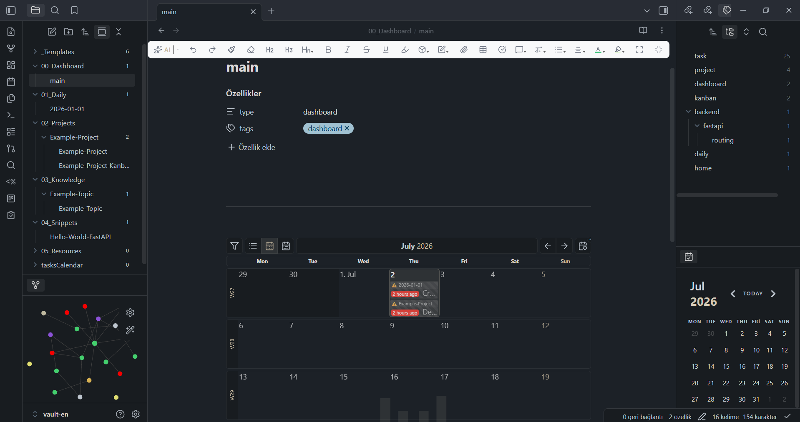
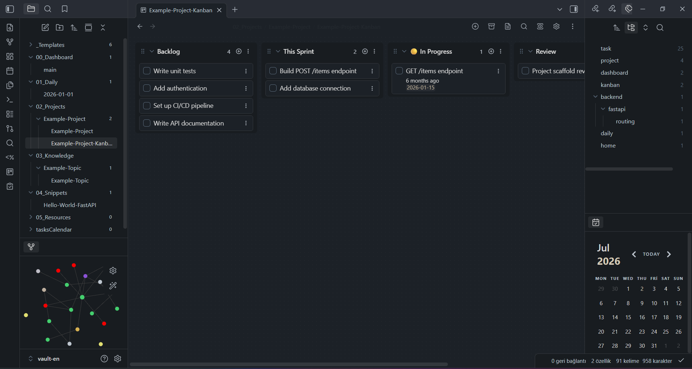
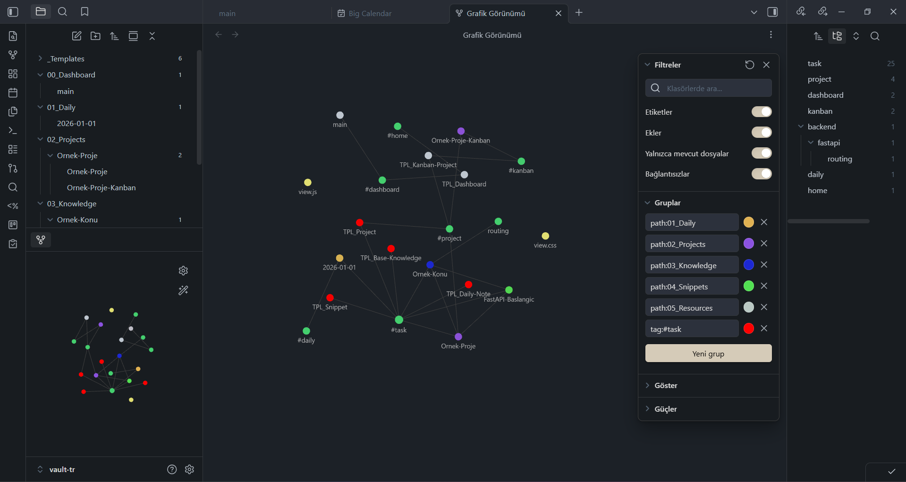

# Obsidian Developer Vault Template

A production-ready, opinionated Obsidian vault template built for developers. Structured for knowledge management, project tracking, daily journaling, and code snippet organization. Available in both English and Turkish.

---

## Language Selection / Dil Secimi

Please choose your language to access the detailed setup and workflow guides:

* ???? **[English Setup and Workflow Guide (Wiki)](https://github.com/senademirbas/obsidian-developer-vault/wiki/Setup-and-Workflow-EN)**
  Open the `Vault-EN/` directory as your vault in Obsidian.

* ???? **[Turkce Kurulum ve Kullanim Rehberi (Wiki)](https://github.com/senademirbas/obsidian-developer-vault/wiki/Kurulum-ve-Kullanim-TR)**
  Obsidian'da `Vault-TR/` klasorunu kasa (vault) olarak acin.

---

## Preview / Ekran Goruntuleri

### English Vault Preview
#### Main Dashboard (Calendar View)

#### Project Kanban Board

#### Knowledge Graph View

---

### Turkce Kasa Gorunumu
#### Ana Panel (Takvim Gorunumu)

#### Proje Kanban Tahtasi

#### Bilgi Agi (Graph View)

---

## Features

- **Developer Dashboard:** Preconfigured monthly tasks calendar powered by DataviewJS.
- **Bilingual Support:** Fully separated Turkish (`Vault-TR/`) and English (`Vault-EN/`) templates.
- **Workflow Automation:** Quick task capture via QuickAdd (`Ctrl+X`) and auto-updating modified date in frontmatter.
- **Custom Tag Highlighting:** Soft colored styling for `#task` and `#bug` tags inside notes.
- **Clean Structure:** Preconfigured folders for daily notes, projects, knowledge base, snippets, and resources.

For detailed configuration, plugin lists, and workflows, please visit the [Project Wiki](https://github.com/senademirbas/obsidian-developer-vault/wiki).
